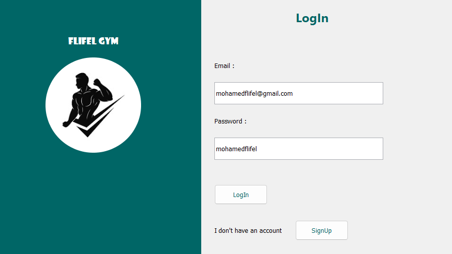
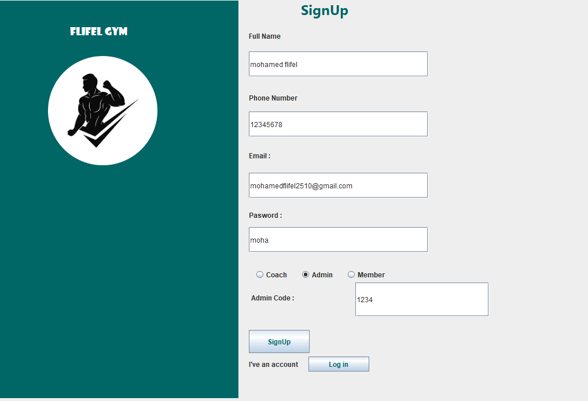
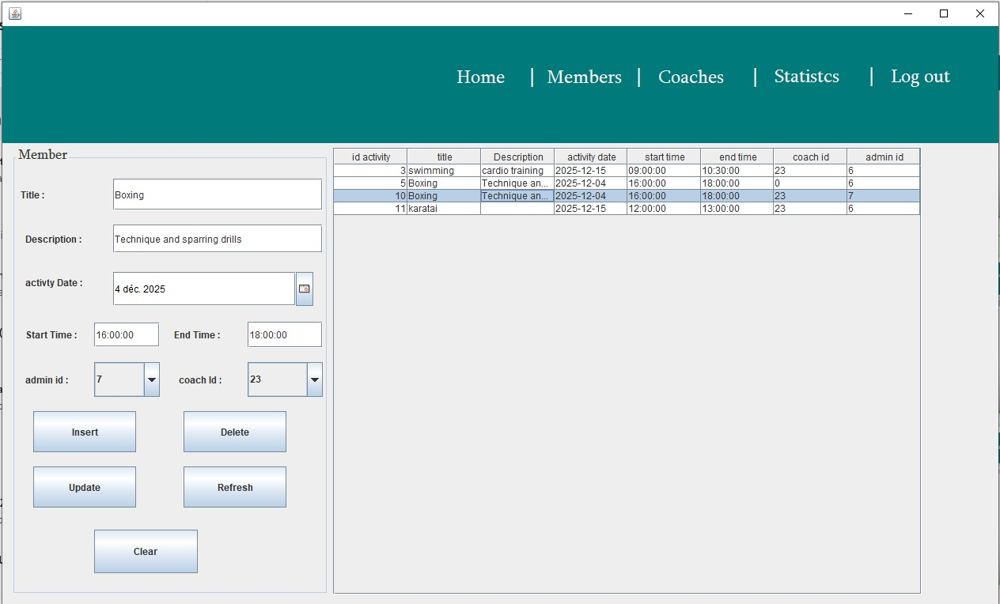
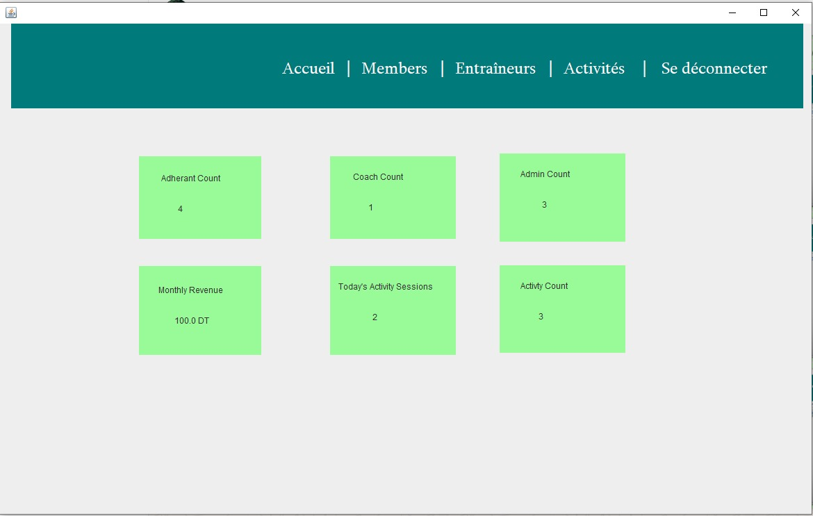
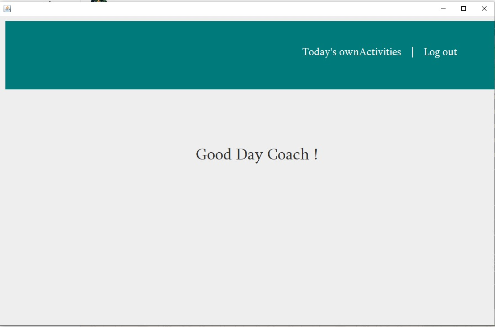
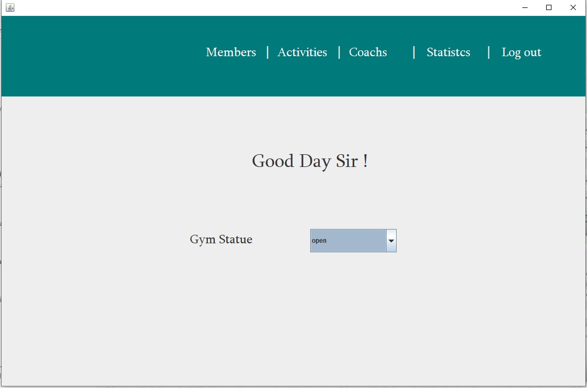
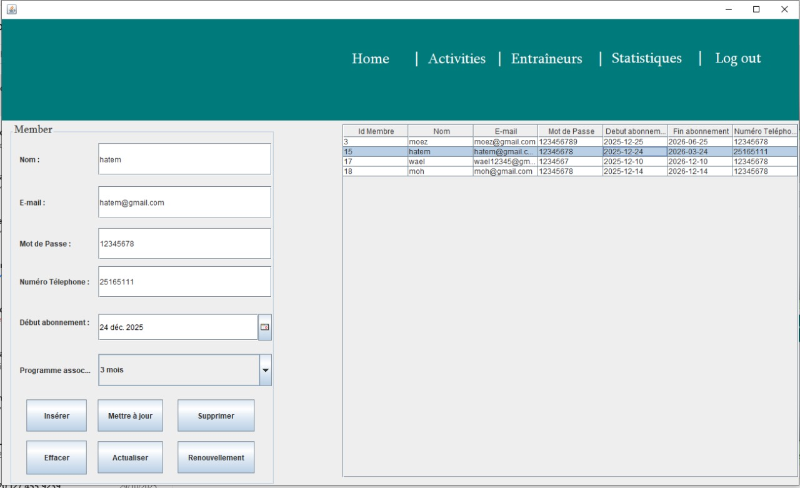

# 🏋️ Flifel Gym — Desktop Management App

<div align="center">


**Une application de gestion complète pour salle de sport — née d'une passion pour le sport et le code.**

</div>

---

## 💡 L'histoire derrière le projet

Ma passion pour le sport m'a toujours accompagné. En tant que pratiquant régulier, j'ai souvent observé à quel point la gestion d'une salle de sport pouvait être chaotique : des registres papier, des abonnements mal suivis, des coachs sans planning clair...

C'est cette frustration, combinée à ma montée en compétences en développement Java, qui m'a donné l'idée de créer **Flifel Gym** — une application desktop complète qui digitalise et simplifie la gestion d'une salle de sport de A à Z.

Ce projet représente l'aboutissement de mes apprentissages en **Java Swing**, **JDBC** et **MySQL**, appliqués à un cas concret qui me tient à cœur.

---

## 📸 Aperçu de l'application

### Écran de connexion & Inscription
### Écran de connexion & Inscription



















https://imgur.com/a/i4jgy8q


### 👤 Gestion des membres
- Inscription et authentification (rôles : Admin, Coach, Membre)
- Fiche complète : nom, téléphone, email, photo avatar
- Suivi des abonnements actifs / expirés

### 🏃 Gestion des coachs
- Profil coach avec spécialités
- Visualisation des activités assignées
- Planning journalier (`CoachTodayActivities`)

### 🏋️ Activités
- Création et gestion des activités sportives
- Attribution des coachs aux activités
- Suivi de la participation des membres (`AdherantTodayActivities`)

### 📊 Statistiques
- Vue d'ensemble des membres actifs
- Suivi de la fréquentation
- Rapports sur les abonnements

### 🔐 Administration
- Panneau admin complet (`AdminInf`)
- Gestion des accès et des rôles
- Configuration de la base de données (`ConfigDb`)

---

## 🛠️ Stack technique

| Technologie | Rôle |
|-------------|------|
| **Java (JDK 8+)** | Langage principal |
| **Java Swing** | Interface graphique desktop |
| **JDBC** | Connexion base de données |
| **MySQL** | Stockage des données |
| **NetBeans 8.2** | IDE de développement |

---

## 🗂️ Structure du projet

```
salle/
├── src/
│   └── <default package>/
│       ├── Activity.java           # Gestion des activités
│       ├── AdherantInf.java        # Informations membres
│       ├── AdherantTodayActivities.java
│       ├── AdminInf.java           # Panel administrateur
│       ├── CoachInf.java           # Informations coachs
│       ├── CoachList.java          # Liste des coachs
│       ├── CoachTodayActivities.java
│       ├── ConfigDb.java           # Configuration BDD
│       ├── ImageAvatar.java        # Gestion des avatars
│       ├── LogIn.java              # Authentification
│       ├── MemberList.java         # Liste des membres
│       ├── Satistics.java          # Statistiques
│       ├── SignUp.java             # Inscription
│       └── gymIcon.jpg             # Logo
├── db/                             # Scripts SQL
├── models/                         # Modèles de données
└── README.md
```

---

## 🚀 Installation & Lancement

### Prérequis
- Java JDK 8 ou supérieur
- MySQL Server 5.7+
- NetBeans IDE 8.2+
- Connecteur JDBC MySQL (`mysql-connector-java.jar`)

### Étapes

**1. Cloner le projet**
```bash
git clone https://github.com/MohamedFlifel/flifel-gym.git
cd flifel-gym
```

**2. Créer la base de données**
```sql
CREATE DATABASE flifel_gym;
USE flifel_gym;
-- Importe le script dans db/
SOURCE db/schema.sql;
```

**3. Configurer la connexion**

Ouvre `ConfigDb.java` et modifie :
```java
String url = "jdbc:mysql://localhost:3306/flifel_gym";
String user = "ton_utilisateur";
String password = "ton_mot_de_passe";
```

**4. Ajouter le driver JDBC**

Dans NetBeans :
- Clic droit sur `Libraries` → `Add JAR/Folder`
- Sélectionne `mysql-connector-java-X.X.X.jar`

**5. Lancer l'application**
- Ouvre le projet dans NetBeans
- `Run` → `Run Project` (ou `F6`)

---

## 👨‍💻 Auteur

**Mohamed Flifel**

[](https://www.linkedin.com/in/mohamed-flifel-8a0a213a7/)
[](https://github.com/mohamedflifel)

---


<div align="center">
  <i>Fait avec passion pour le sport et le code ⚡</i>
</div>
